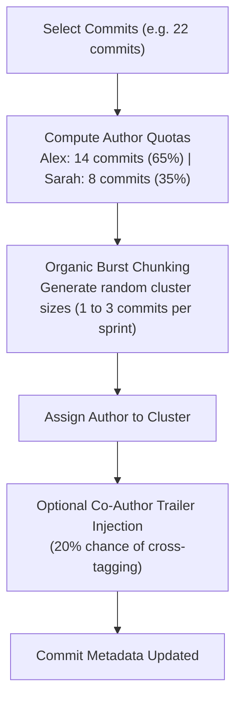

# 👥 Design Proposal: Multi-Author & Team Collaboration Suite

This document specifies the technical design, UI mockups, and algorithm architecture for **Multi-Author Management, Team Rosters, Author Badges, and Pair-Programming Simulation** in `toolgit`.

---

## 📖 Table of Contents
1. [🎯 Objectives & Use Cases](#-objectives--use-cases)
2. [🖥️ UI & Terminal Mockups](#️-ui--terminal-mockups)
3. [⚙️ Feature Specifications](#️-feature-specifications)
4. [📐 Technical Architecture & Data Models](#-technical-architecture--data-models)
5. [🌿 Team Ratio Distribution Algorithm](#-team-ratio-distribution-algorithm)
6. [🗺️ Implementation Roadmap](#️-implementation-roadmap)

---

## 🎯 Objectives & Use Cases

### Why Multi-Author Support?
1. **Team & Pair-Programming Realism:** Many repositories are built by 2+ developers. Automatically simulating natural collaboration patterns makes reconstructed histories 100% believable.
2. **Zero-Friction Author Assignment:** Instead of manually typing name and email strings into text boxes for every batch, pick from an auto-discovered repository contributor roster with 1 keystroke.
3. **GitHub Contribution Graph Distribution:** Enables multi-developer accounts to receive accurate contribution squares, commit counts, and streak credit on GitHub.
4. **Official Co-Authorship (`Co-authored-by:`):** Formats Git message trailers so GitHub and GitLab UI natively display multiple contributor avatars on joint commits.

---

## 🖥️ UI & Terminal Mockups

### 1. Main Dashboard with Color-Coded Author Badges
The commit list displays author initials (`[AC]`, `[SC]`, `[AV]`), and the right pane shows team contributor stats:

```text
  ❖ toolgit   Safe Git Commit Metadata Editor                               🌿 main   
╭────────────────────────────────────────────────────────╮╭────────────────────────────────────────────────────────────╮
│ Commits (3 Authors Detected)                      4/22 ││ Commit b12935f  ● Unchanged  ○ Not Selected                │
│                                                        ││                                                            │
│   [✓] b12935f 👤[AC] test: cover regression tests…     ││ Full SHA:     b12935f0a9b8c7d6e5f4a3b2c1d0e9f8a7b6c5d4e   │
│   [ ] f0dd4c8 👤[SC] test: cover assertions and ex…    ││ Author:       Alex Chen                                    │
│   [✓] efa584c 👤[AV] feat: mask secrets in diagnos…    ││ Email:        alex.chen@cyberdyne.io                       │
│   [ ] a8bedf8 👤[AC] feat: expose AssertFlow runner…   ││ Co-Authors:   Sarah Connor <s.connor@cyberdyne.io>         │
│   [ ] f1aa244 👤[SC] feat: orchestrate ordered API…    ││ Date:         Wed Apr 08, 2026 • 15:42:19 IST              │
│   [ ] a77825e 👤[AV] feat: parse and validate YAML…    ││ Relative:     2 hours ago                                  │
│                                                        ││                                                            │
│                                                        ││ 👥 Team Breakdown:                                         │
│                                                        ││  • [AC] Alex Chen        11 commits (50%)                  │
│                                                        ││  • [SC] Sarah Connor      7 commits (32%)                  │
│                                                        ││  • [AV] Abhay Vansadia    4 commits (18%)                  │
│                                                        ││                                                            │
│                                                        ││ Message:                                                   │
│                                                        ││ │ test: cover regression tests and assertions              │
│                                                        ││ │                                                          │
│                                                        ││ │ Co-authored-by: Sarah Connor <s.connor@cyberdyne.io>     │
╰────────────────────────────────────────────────────────╯╰────────────────────────────────────────────────────────────╯

 ● Ready. [3 commits selected]  [3 selected / 22 total]                                          
  ↑/↓  Nav   Space  Select   a  All   e  Author / Team   d  Times   w  Rewrite   q  Quit 
```

---

### 2. Enhanced Author Modal (<kbd>e</kbd>): Team Roster & Quick-Pick

Pressing <kbd>e</kbd> presents a roster of discovered repository contributors:

```text
╭─────────────────────────────────────────────────────────────╮
│ ✏️  Author & Team Assignment                                │
│                                                             │
│ 🎯 Scope: 8 selected commit(s)                              │
│                                                             │
│ 👥 Select from Repository Contributors:                     │
│  (●) 1. Alex Chen       <alex.chen@cyberdyne.io>     (11)   │
│  ( ) 2. Sarah Connor    <s.connor@cyberdyne.io>      (7)    │
│  ( ) 3. Abhay Vansadia  <abhaysinhvansadia208@gmail> (4)    │
│  ( ) 4. + Add New Contributor / Custom...                   │
│                                                             │
│ ─────────────────────────────────────────────────────────── │
│ 🤝 Co-Authorship Options:                                   │
│  [✓] Add 'Co-authored-by' trailer to commit message         │
│      Co-Author: Sarah Connor <s.connor@cyberdyne.io>        │
│                                                             │
│ [1-4] Quick Assign  •  [Tab] Co-Author  •  [Enter] Apply    │
╰─────────────────────────────────────────────────────────────╯
```

---

### 3. Automated Team Ratio Distribution Modal

Allows distributing a batch of selected commits across team members by percentage:

```text
╭─────────────────────────────────────────────────────────────╮
│ 🎲 Distribute Commits across Team Roster                    │
│                                                             │
│ Target: 22 selected commits                                 │
│                                                             │
│  • [AC] Alex Chen (Lead):     [ 65% ]  -> ~14 commits       │
│  • [SC] Sarah Connor (Pair):  [ 35% ]  -> ~8 commits        │
│                                                             │
│ ⚙️ Distribution Behavior:                                    │
│  [✓] Organic Clustering (bursts of 2-4 commits per author)  │
│  [✓] Cross Co-Authorship (tag pair on 20% of commits)       │
│                                                             │
│ [Tab] Switch Field  •  [Enter] Distribute Authors  •  [Esc] │
╰─────────────────────────────────────────────────────────────╯
```

---

## ⚙️ Feature Specifications

### Feature 1: Automatic Contributor Discovery
* On repo load, scan all commits and compile a unique list of:
  ```go
  type Contributor struct {
      Name        string
      Email       string
      Initials    string // e.g. "AC"
      Color       string // ANSI/Hex color hash
      CommitCount int
  }
  ```

### Feature 2: Color-Coded Author Badges
* Generates a deterministic ANSI color based on author email hash.
* Renders compact 4-character badge in commit list rows: `[AC]`, `[SC]`.

### Feature 3: 1-Key Quick Assignment
* In the Author modal, pressing numbers `1`, `2`, `3` instantly selects that contributor.

### Feature 4: GitHub `Co-authored-by` Trailer Support
* Formats commit messages according to the official GitHub co-author standard:
  ```text
  feat: implement distributed lock manager

  Co-authored-by: Sarah Connor <s.connor@cyberdyne.io>
  ```

---

## 📐 Technical Architecture & Data Models

### Data Structures (`main.go` / `git.go`)

```go
// Contributor represents a unique author in the repository.
type Contributor struct {
    Name        string
    Email       string
    Initials    string
    Color       lipgloss.Color
    CommitCount int
}

// AuthorRatio defines allocation weights for multi-author simulation.
type AuthorRatio struct {
    Contributor Contributor
    Percentage  int // e.g. 65
}

// ExtractContributors analyzes loaded commits and returns unique team members.
func ExtractContributors(commits []*CommitState) []Contributor {
    counts := make(map[string]*Contributor)
    for _, c := range commits {
        key := c.AuthorEmail
        if existing, found := counts[key]; found {
            existing.CommitCount++
        } else {
            counts[key] = &Contributor{
                Name:        c.AuthorName,
                Email:       c.AuthorEmail,
                Initials:    getInitials(c.AuthorName),
                CommitCount: 1,
            }
        }
    }
    // Return sorted by commit count descending
    ...
}
```

---

## 🌿 Team Ratio Distribution Algorithm

When distributing $N$ commits across $K$ team members with ratios $R_1, R_2, \dots, R_K$:



1. **Quota Calculation:** $N_k = \text{round}(N \cdot R_k)$.
2. **Burst Allocation:** Developers don't alternate every single commit (1 by A, 1 by B). Instead, the algorithm generates clusters of 2 to 4 consecutive commits by Author A, followed by a cluster by Author B.
3. **Chronological Alignment:** Seamlessly integrates with `DistributeTimesOrganic` so commit timestamps and author shifts align with realistic workdays.

---

## 🗺️ Implementation Roadmap

- [ ] **Phase 1: Contributor Discovery & Roster Picker**
  - Implement `ExtractContributors()`.
  - Add quick-pick list `(1) Alex (2) Sarah` inside `EditAuthorModal`.
- [ ] **Phase 2: Visual Badges in Dashboard**
  - Add author initials and color badges (`[AC]`) to commit list items.
  - Add team contribution breakdown card in the details pane.
- [ ] **Phase 3: `Co-authored-by` Trailer Support**
  - Add co-author selector in modal and append trailers during Git commit rewriting.
- [ ] **Phase 4: Automated Team Ratio Distribution**
  - Implement burst clustering algorithm and distribution modal.
