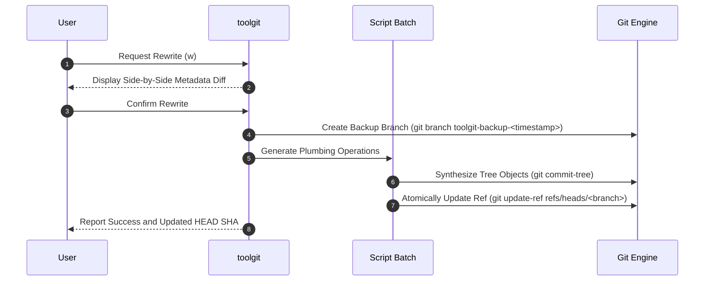

# toolgit

Fast, non-destructive Terminal User Interface (TUI) for inspecting, modifying, and batch-distributing Git commit metadata.

[](https://github.com/abhaysinh8/toolgit/actions/workflows/ci.yml)
[](https://go.dev/)
[](https://github.com/charmbracelet/bubbletea)
[](https://github.com/charmbracelet/lipgloss)
[](#installation)

---

## Overview

`toolgit` is an interactive terminal application designed to inspect, edit, and reorganize Git commit history without the overhead and risks associated with interactive rebase (`git rebase -i`) or external filter scripts.

Powered by [Bubble Tea](https://github.com/charmbracelet/bubbletea) and [Lip Gloss](https://github.com/charmbracelet/lipgloss), `toolgit` provides an adaptive split-pane terminal dashboard for navigating commit logs, editing author and committer metadata in batch, distributing timestamps across realistic active workdays, and safely rewriting commit graphs via low-level Git plumbing. Every rewrite automatically creates an isolated backup branch, allowing instant one-key rollbacks.

## Features

- **Adaptive Split-Pane Interface**: Responsive two-column dashboard. The left pane provides an interactive commit table with selection and modification markers; the right pane displays structured metadata (full SHA, author, committer, exact ISO timestamp, relative age, and commit message). Layout automatically recalculates on terminal resize and zoom events without line wrapping or viewport overflow.
- **Organic Timestamp Jitter**: Avoids artificial linear spacing and synthetic `:00` seconds. Uses weighted interval distribution and micro-variance to generate natural commit gaps (20 minutes to multiple hours) and realistic seconds.
- **Multi-Day Workday Partitioning**: Automatically distributes commit batches across a configurable number of distinct active days, respecting daytime working hours (e.g., 09:00 to 17:00) and natural rest intervals.
- **Batch Author and Committer Editing**: Modify author name and email address for a single commit or in batch across all selected commits.
- **Time Range Presets**: Built-in presets for common intervals ("Today Workday", "Yesterday Workday", "Past 3 Hours", "Past 8 Hours") alongside custom date and time range inputs.
- **Side-by-Side Dry-Run Review**: Visual diff preview displaying original commit metadata against proposed modifications before changes are written to the repository.
- **Non-Destructive Git Plumbing**: Leverages direct `git commit-tree` and `git update-ref` calls. Bypasses the working tree and index entirely, ensuring uncommitted files remain untouched.
- **Automated Safety Backups and Rollback**: Creates an automated snapshot branch (`toolgit-backup-<timestamp>`) before any rewrite. An integrated rollback menu allows instant restoration of previous commit states.
- **Mock Mode**: Automatically loads simulated commit data when executed outside a Git repository, allowing full TUI evaluation without repository setup.

## Table of Contents

- [Installation](#installation)
- [Quick Start](#quick-start)
- [Usage Guide](#usage-guide)
- [Keyboard Shortcuts](#keyboard-shortcuts)
- [Architecture and Safety](#architecture-and-safety)
- [Testing](#testing)
- [Repository Structure](#repository-structure)
- [Additional Documentation](#additional-documentation)

---

## Installation

### Prerequisites

- [Go 1.21](https://go.dev/dl/) or newer
- [Git](https://git-scm.com/) installed and available in your system `PATH`

### Build from Source

```bash
# Clone the repository
git clone https://github.com/abhaysinh8/toolgit.git
cd toolgit

# Compile binary with stripped symbols
go build -ldflags "-s -w" -o toolgit.exe ./cmd/toolgit
```

### Install with Go

```bash
go install ./cmd/toolgit
```

### Windows Automated Installer

The repository includes an installer script that verifies the environment, executes the test suite, builds an optimized binary, and registers the binary directory in your user `PATH`:

```powershell
# PowerShell
.\scripts\build\update.ps1
```

```cmd
:: Command Prompt
.\scripts\build\update.cmd
```

### Pre-built Releases

Compiled standalone binaries for Windows (`amd64` and `arm64`) are published automatically on the [GitHub Releases](https://github.com/abhaysinh8/toolgit/releases) page for each tagged release.

---

## Quick Start

Open any terminal inside a Git repository and launch the tool:

```bash
toolgit
```

> [!NOTE]
> If run outside a Git repository, `toolgit` launches in **Mock Mode**, providing sample commits to explore the user interface, keybindings, and modal dialogues safely without modifying any files.

---

## Usage Guide

### 1. Navigation and Selection
- Use <kbd>j</kbd> / <kbd>k</kbd> or <kbd>Down</kbd> / <kbd>Up</kbd> arrows to navigate the commit table.
- Press <kbd>Space</kbd> to toggle selection for individual commits.
- Press <kbd>a</kbd> to toggle selection across all commits in the repository.

### 2. Editing Author Metadata
- Select one or more commits and press <kbd>e</kbd> to open the Author Editor modal.
- Enter the updated Author Name and Email Address.
- Press <kbd>Enter</kbd> to apply the values. Modified commits are flagged with an edit indicator in the table.

### 3. Timestamp Distribution
- Select the target commits.
- Press <kbd>t</kbd> to quick-distribute selected commits across standard workday hours (09:00 to 17:00) for the current day.
- Or press <kbd>d</kbd> to open the Time Distribution modal:
  - Choose a preset (e.g., "Today Workday", "Yesterday Workday", "Past 3h", "Past 8h").
  - Or select "Custom Range..." to define specific start and end timestamps along with the target number of active days.
  - Commits are redistributed using organic jitter, ensuring strict chronological monotonicity and randomized second offsets.

### 4. Reviewing and Applying Changes
- Press <kbd>w</kbd> to open the Dry-Run Review modal.
- Review the side-by-side diff detailing original vs. proposed commit metadata.
- Press <kbd>Enter</kbd> to confirm. `toolgit` creates a backup branch, writes the new commit objects via Git plumbing, and updates the branch reference.

### 5. Rollback and History Restoration
- Press <kbd>r</kbd> to open the Rollback menu.
- A list of previous backup branches (`toolgit-backup-<timestamp>`) will be shown.
- Select a backup branch and press <kbd>Enter</kbd> to restore `HEAD` to that snapshot.

---

## Keyboard Shortcuts

| Key | Action | Description |
|---|---|---|
| <kbd>j</kbd> / <kbd>↓</kbd> | Navigate Down | Move cursor down with automatic windowed scrolling |
| <kbd>k</kbd> / <kbd>↑</kbd> | Navigate Up | Move cursor up with automatic windowed scrolling |
| <kbd>Space</kbd> | Toggle Selection | Select or deselect the active commit |
| <kbd>a</kbd> | Select All | Toggle selection across all commits |
| <kbd>e</kbd> | Edit Author | Open Author Name and Email editor modal |
| <kbd>d</kbd> | Time Picker | Open Time Distribution and Active Days modal |
| <kbd>t</kbd> | Quick Workday | Distribute selected commits between 09:00 and 17:00 today |
| <kbd>w</kbd> | Dry-Run Review | Open side-by-side diff review and confirm rewrite |
| <kbd>r</kbd> | Rollback Menu | Browse and restore safety backup branches |
| <kbd>q</kbd> / <kbd>Esc</kbd> | Back / Quit | Dismiss active modal or exit application |
| <kbd>Ctrl+C</kbd> | Force Exit | Immediately terminate process |

---

## Architecture and Safety

### Non-Destructive Git Plumbing Engine

`toolgit` avoids high-level interactive rebase operations that manipulate the working tree or index. Instead, it interacts directly with the Git object store using plumbing commands:



1. **Working Tree Isolation**: All new commit objects are synthesized directly in the Git repository database via `git commit-tree`. Unstaged changes, staged index entries, and untracked files are never touched.
2. **Atomic Reference Updates**: Upon computing the revised commit DAG, the branch reference is updated atomically via `git update-ref`.
3. **Pre-Rewrite Safety Backups**: Prior to executing any ref update, `toolgit` captures the current branch state into a timestamped snapshot (`refs/heads/toolgit-backup-<timestamp>`).

### Organic Timestamp Simulation

Linear interpolation produces unnatural commit artifacts (fixed minute steps, identical `:00` seconds, and commits landing during non-work hours). `toolgit` implements an organic simulation algorithm:

- **Dynamic Gap Sizing**: Intervals between commits vary dynamically based on normalized random weights ($w_i \in [0.5, 1.5]$).
- **Randomized Seconds**: Second values are randomized across natural ranges, eliminating robotic uniform seconds.
- **Active Days Constraint**: Commits are partitioned across a specified count of distinct workdays during daytime hours, leaving natural multi-day rest periods between active coding sessions.
- **Strict Monotonicity**: Preserves the chronological invariant $t_{i+1} > t_i$, preventing negative time intervals across the commit graph.

---

## Testing

The test suite includes unit tests, time distribution mathematical invariant checks, and end-to-end repository rewrite workflows:

```bash
# Run all tests
go test -v ./...

# Run fast unit tests only
go test -v ./internal/...
```

### Hot Reloading in Development

A PowerShell file watcher script is included to recompile and test on file save:

```powershell
.\scripts\dev\watch.ps1
```

### Packaging and Release Automation

Releases are managed via GitHub Actions (`.github/workflows/release.yml`). Pushing a semantic version tag triggers cross-compilation for Windows (`amd64` and `arm64`) and publishes assets to GitHub Releases:

```bash
git tag v1.0.0
git push origin v1.0.0
```

To cross-compile locally:

```powershell
.\scripts\build\release.ps1
```

---

## Repository Structure

```
toolgit/
├── cmd/
│   └── toolgit/          # Application entry point
├── internal/
│   ├── app/              # TUI components, state machines, views, and time distribution
│   ├── core/             # Shared domain models (CommitState, DiffItem)
│   └── git/              # Git plumbing, log parsing, backup, and rewrite engine
├── scripts/
│   ├── build/            # PowerShell and Batch build/install scripts
│   └── dev/              # Development watcher scripts
├── docs/                 # Architectural specifications and design proposals
├── go.mod                # Go module dependencies
└── README.md             # Project documentation
```

---

## Additional Documentation

- [HOW_IT_WORKS.md](./docs/HOW_IT_WORKS.md) - Deep-dive into internal mechanics, mathematical distribution equations, and viewport windowing algorithms.
- [MULTI_AUTHOR_PROPOSAL.md](./docs/MULTI_AUTHOR_PROPOSAL.md) - Design proposal for contributor rosters, pair-programming distribution, and `Co-authored-by` trailer support.

