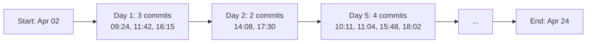
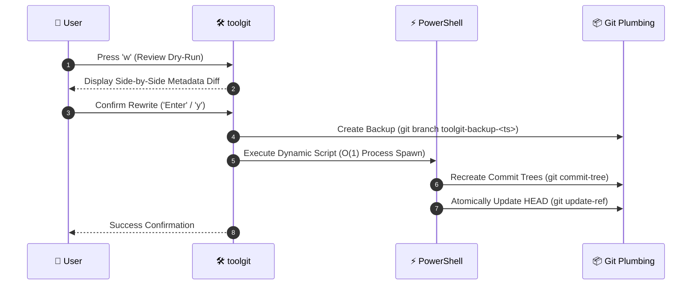

# 🛠️ toolgit

<p align="center">
  <strong>Fast, non-destructive Terminal User Interface (TUI) for safely inspecting, modifying, and batch-distributing Git commit metadata.</strong>
</p>

<p align="center">
  
  
  
  
</p>

---

## 📖 Table of Contents
- [✨ Key Features](#-key-features)
- [⌨️ Keyboard Shortcuts](#️-keyboard-shortcuts)
- [🚀 Quick Start & Installation](#-quick-start--installation)
- [🌿 Organic Time Jitter & Active Days](#-organic-time-jitter--active-days)
- [🛡️ Safety & Git Plumbing Engine](#️-safety--git-plumbing-engine)
- [🧪 Running the Test Suite](#-running-the-test-suite)
- [📂 Project Architecture](#-project-architecture)
- [📚 Deep-Dive Documentation](#-deep-dive-documentation)

---

## ✨ Key Features

| Feature | Description |
|---|---|
| 🖥️ **Split-Pane Layout** | **Left (~48%)**: Smooth windowed commit list with selection markers (`[✓]`) and edit flags (`✎`).<br>**Right (~52%)**: Metadata card showing Full SHA, Author, Email, Timestamps, Relative Age, and message quote block. |
| 🌿 **Organic Human Jitter** | Eliminates robotic mathematical steps and identical `:00` seconds with natural gap variance and randomized seconds. |
| 📅 **Multi-Day Active Days** | Partition commits across a chosen number of active days (e.g. 22 commits over 10 distinct days) during daytime hours. |
| 👤 **Interactive Author Editor** | Edit Author Name and Email for single commits or in batch across all selected commits with live form navigation. |
| ⏳ **Smart Time Range Picker** | Instant presets (*"Today Workday"*, *"Yesterday Workday"*, *"Past 3h"*, *"Past 8h"*) plus full custom date range controls. |
| 🛡️ **Non-Destructive Dry-Run** | Side-by-side diff inspection with **automatic safety backup branches** (`toolgit-backup-<timestamp>`) before any rewrite. |
| ⚡ **Live Dev Toolchain** | Fast build script (`update.ps1`) and file watcher (`watch.ps1`) for automatic hot rebuilding on save. |

---

## ⌨️ Keyboard Shortcuts

| Shortcut | Action | Description |
|---|---|---|
| <kbd>j</kbd> / <kbd>↓</kbd> | **Navigate Down** | Move cursor down with automatic windowed scrolling |
| <kbd>k</kbd> / <kbd>↑</kbd> | **Navigate Up** | Move cursor up with automatic windowed scrolling |
| <kbd>Space</kbd> | **Toggle Select** | Select or deselect the active commit for batch actions |
| <kbd>a</kbd> | **Select All** | Toggle selection across all commits in the repository |
| <kbd>e</kbd> | **Edit Author** | Open the interactive Author Name & Email editor modal |
| <kbd>d</kbd> | **Time Picker** | Open the Time Distribution & Active Days picker modal |
| <kbd>t</kbd> | **Quick 9-to-5** | Quick-distribute selected commits between 09:00 AM – 05:00 PM today |
| <kbd>w</kbd> | **Dry-Run Review** | Open the side-by-side diff review modal and confirm rewrite |
| <kbd>q</kbd> / <kbd>Esc</kbd> | **Quit / Back** | Close active modal or quit the application |
| <kbd>Ctrl+C</kbd> | **Force Exit** | Instant clean process shutdown |

---

## 🚀 Quick Start & Installation

### Prerequisites
- [Go 1.21+](https://go.dev/dl/)
- [Git](https://git-scm.com/) (available in system PATH)

### 1. Build and Install Globally
Run the automated update script to test, compile, and register `toolgit` into your terminal PATH:

```powershell
# In PowerShell:
.\update.ps1
```

*(Or in Windows Command Prompt: `.\update.cmd`)*

### 2. Launch Anywhere
Once installed, open any terminal in any Git repository and run:

```bash
toolgit
```

> [!TIP]
> If run outside a Git repository, `toolgit` automatically launches in **Mock Mode** (`🧪 Mock Mode`), allowing you to test all TUI features and algorithms safely without modifying any files.

---

## 🌿 Organic Time Jitter & Active Days

Unlike naive linear interpolation ($\Delta t = \frac{\text{End} - \text{Start}}{N - 1}$) which creates an artificial grid of commits landing at identical seconds and midnight hours, `toolgit` uses **Organic Developer Simulation**:



- **Natural Gaps:** Intervals between commits vary dynamically from 20 minutes to 2+ hours.
- **Randomized Seconds:** Timestamps land on realistic natural seconds (e.g. `14:28:43`).
- **Active Days Constraint:** Spreads commits across your specified number of active days, preserving realistic coding days and rest intervals.

---

## 🛡️ Safety & O(1) Git Plumbing Engine

`toolgit` does **not** use fragile interactive git rebases. It leverages direct **Git plumbing** commands optimized into an **$O(1)$ native PowerShell process runspace**:



> [!IMPORTANT]
> **Working Tree Safety:** Git plumbing updates commit graph references directly without touching files on disk. Your working tree remains clean and untouched.

---

## 🧪 Running the Test Suite

Unit, integration, and end-to-end repository workflow tests ensure mathematical accuracy, monotonicity, and plumbing safety:

```bash
go test -v ./...
```

---

## 📂 Project Architecture

```
toolgit/
├── main.go               # Core TUI model, event loop, view router, and organic distribution engine
├── git.go                # Git detection, commit loader, backup branch creator, and rewrite engine
├── modals.go             # Interactive modal views (Author editor, Time & Days picker, Dry-Run diff)
├── main_test.go          # Unit tests for organic jitter, multi-day partitioning, and modal parsing
├── git_test.go           # Integration tests for Git commit rewriting and safety backups
├── sample_repo_test.go   # End-to-end live repository workflow simulation test
├── update.ps1            # PowerShell test, build, and global installer script
├── update.cmd            # Batch test, build, and global installer script
├── watch.ps1             # Background file watcher for auto-rebuilding on save
├── go.mod                # Go module dependencies
├── README.md             # Project documentation
├── HOW_IT_WORKS.md       # Internal architecture and mechanics guide
├── REWRITE_FLOW_PROPOSAL.md # Design proposal for 2-stage rewrite modal flow
└── MULTI_AUTHOR_PROPOSAL.md # Design proposal for multi-author & team collaboration suite
```

---

## 📚 Deep-Dive Documentation

- 👉 **[HOW_IT_WORKS.md](file:///e:/qa/toolgit/HOW_IT_WORKS.md)**: Mathematical models for organic jitter, Git plumbing architecture, and viewport windowing algorithms.
- 👉 **[REWRITE_FLOW_PROPOSAL.md](file:///e:/qa/toolgit/REWRITE_FLOW_PROPOSAL.md)**: Design proposal for the interactive 2-stage Review $\rightarrow$ Done rewrite modal workflow.
- 👉 **[MULTI_AUTHOR_PROPOSAL.md](file:///e:/qa/toolgit/MULTI_AUTHOR_PROPOSAL.md)**: Design proposal for team contributor rosters, author initials badges, pair-programming distribution, and GitHub `Co-authored-by:` trailers.
