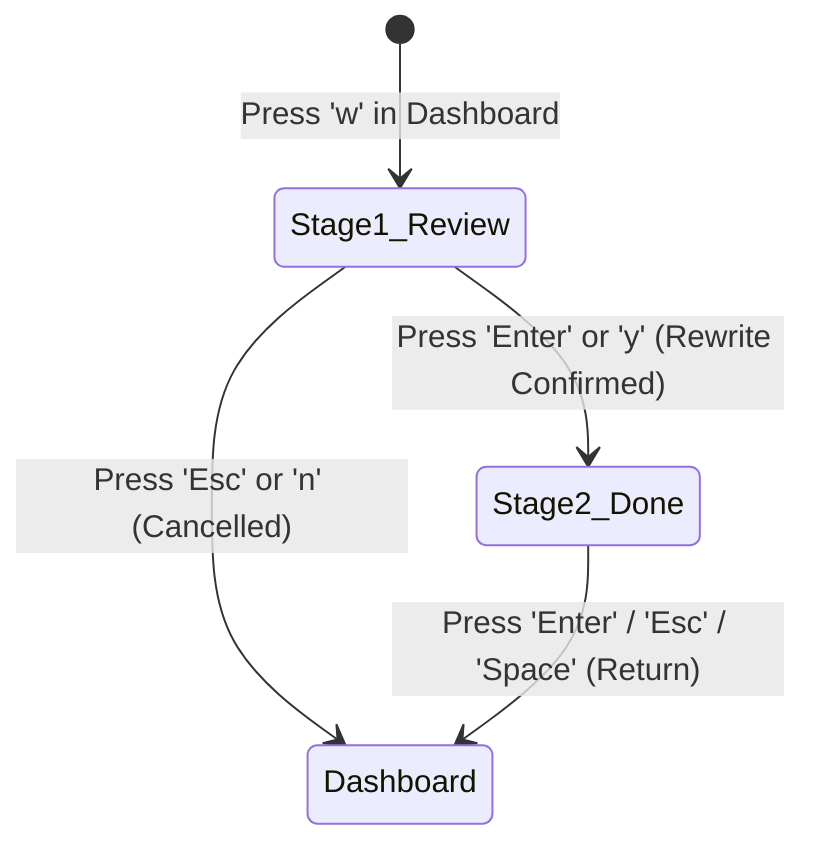

# 💡 Design Proposal: 2-Stage Rewrite & Confirmation Flow

This document details the design and architecture for the proposed **2-Stage Rewrite & Confirmation Flow** in `toolgit`.

---

## 🎯 Motivation & Objectives

### Current Flow
Currently, pressing <kbd>w</kbd> opens the Dry-Run Review modal. When the user confirms with <kbd>Enter</kbd> or <kbd>y</kbd>:
- The modal **immediately closes**.
- The main view updates its status line to show the backup branch.
- **Limitation:** The transition is abrupt and doesn't give the user a clear celebration or summary of the created backup branch before returning to the dashboard.

### Proposed 2-Stage Flow
Introduce an explicit **Review $\rightarrow$ Execution Summary (Done)** state machine inside `DryRunModal`:



---

## 🖥️ Screen Mockups

### Stage 1: Review & Dry-Run Diffs
When you press <kbd>w</kbd> on the dashboard:

```text
╭────────────────────────────────────────────────────────────────────────────╮
│ 🔍 Dry-Run: Review Git History Rewrite                                     │
│                                                                            │
│ ✓ Real Git Repository detected. Automatic safety backup branch will be     │
│   created before any history modification.                                 │
│                                                                            │
│ Commits to rewrite: 5 total (5 modified)                                   │
│                                                                            │
│ HASH     | AUTHOR             | OLD DATE         | NEW DATE                │
│ ────────────────────────────────────────────────────────────────────────── │
│ ✎ 7f3a9b2 | Grace Hopper       | 08/27 09:00:00   | 08/26 09:24:18          │
│ ✎ 3d2e1f0 | Grace Hopper       | 08/27 10:00:00   | 08/26 11:42:05          │
│ ✎ a1b2c3d | Grace Hopper       | 08/27 11:00:00   | 08/26 14:08:22          │
│ ✎ e9f8a7b | Grace Hopper       | 08/27 12:00:00   | 08/26 16:15:39          │
│ ✎ 5c4b3a2 | Grace Hopper       | 08/27 13:00:00   | 08/26 17:30:51          │
│                                                                            │
│ [Enter / y] Confirm & Rewrite History   •   [Esc / n] Cancel               │
╰────────────────────────────────────────────────────────────────────────────╯
```

---

### Stage 2: Execution Done & Safety Summary
After pressing <kbd>Enter</kbd> or <kbd>y</kbd>, the modal transitions to the **Done** screen:

```text
╭────────────────────────────────────────────────────────────────────────────╮
│ 🎉 Git History Rewrite Complete!                                           │
│                                                                            │
│ 🌿 Target Branch:    main                                                  │
│ 🛡️ Safety Backup:    toolgit-backup-20260827-140523                         │
│                                                                            │
│ ────────────────────────────────────────────────────────────────────────── │
│  ✓ 5 commit(s) successfully rewritten via Git plumbing                     │
│  ✓ Commit hashes, timestamps, and author signatures updated                │
│  ✓ Working tree is clean (zero disk checkout overhead)                     │
│                                                                            │
│  💡 Rollback at any time with:                                             │
│     git reset --hard toolgit-backup-20260827-140523                        │
│ ────────────────────────────────────────────────────────────────────────── │
│                                                                            │
│              👉 Press [Enter] or [Esc] to Return to Dashboard              │
╰────────────────────────────────────────────────────────────────────────────╯
```

---

## 📐 Technical Architecture & Implementation Plan

### 1. Modal State Machine (`modals.go`)

```go
type DryRunState int

const (
    DryRunStateReview DryRunState = iota
    DryRunStateDone
)

type DryRunModal struct {
    State        DryRunState
    Diffs        []DiffItem
    BackupBranch string
    TargetBranch string
    IsRealRepo   bool
    ErrorMsg     string
    Rewritten    int
}
```

### 2. Key Event Handling (`main.go`)

```go
case ModalDryRun:
    if m.dryRunModal.State == DryRunStateReview {
        switch msg.String() {
        case "esc", "n", "N":
            m.activeModal = ModalNone
            return m, nil
        case "enter", "y", "Y":
            if m.isRealRepo {
                backup, err := ExecuteHistoryRewrite(m.commits)
                if err != nil {
                    m.dryRunModal.ErrorMsg = err.Error()
                    return m, nil
                }
                m.dryRunModal.BackupBranch = backup
                m.dryRunModal.TargetBranch = m.currentBranch
                m.dryRunModal.Rewritten = len(m.commits)
                m.dryRunModal.State = DryRunStateDone
                m.status = "✓ History rewritten successfully! Backup: " + backup
                m.statusOk = true
            }
            return m, nil
        }
    } else if m.dryRunModal.State == DryRunStateDone {
        // Any exit key returns to main dashboard
        switch msg.String() {
        case "enter", "esc", "q", " ":
            m.activeModal = ModalNone
            // Refresh commit state from disk
            if m.isRealRepo {
                commits, err := LoadGitCommits()
                if err == nil {
                    m.commits = commits
                }
            }
            return m, nil
        }
    }
```

---

## 🌟 Benefits of this Design

1. **Clear Confirmation & Peace of Mind:** Users clearly see the exact backup branch name and rollback command before closing the view.
2. **Smooth Flow:** Pressing <kbd>Enter</kbd> or <kbd>Esc</kbd> returns naturally to the dashboard with refreshed commits.
3. **Rollback Visibility:** Prominently displays the `git reset --hard toolgit-backup-...` command in case the user wants to revert.
