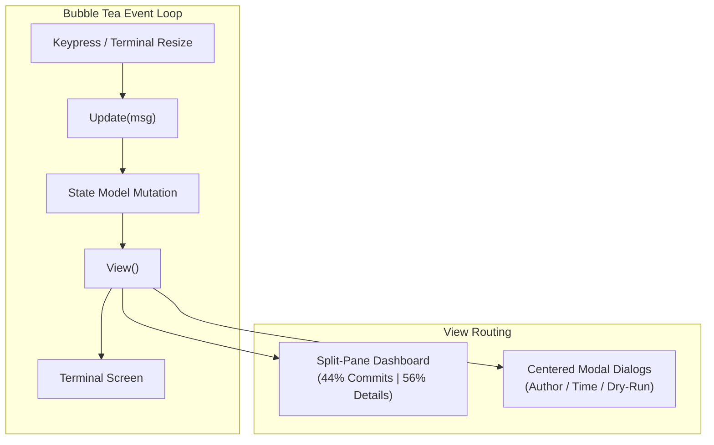
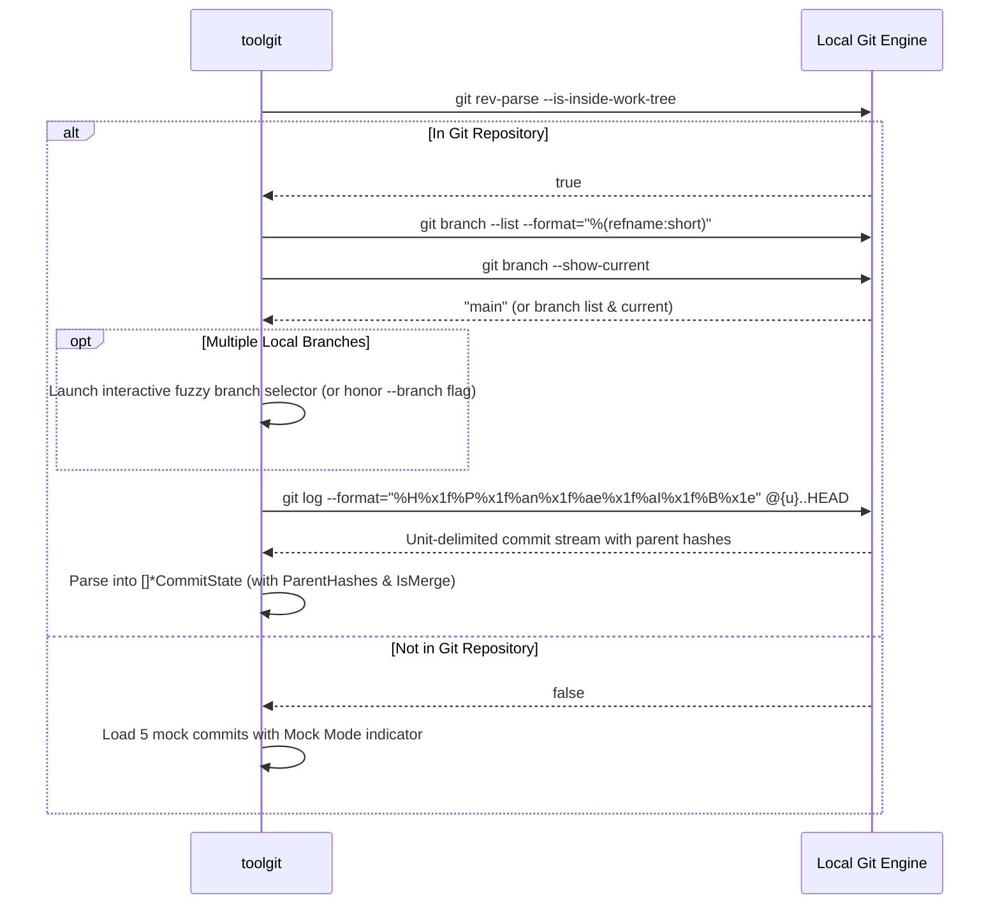
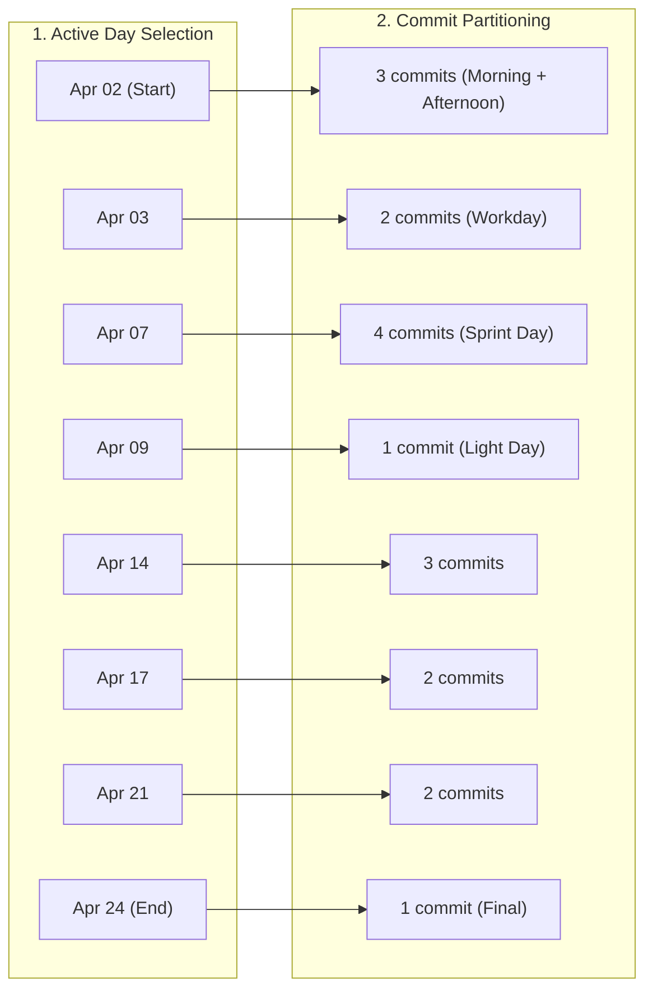
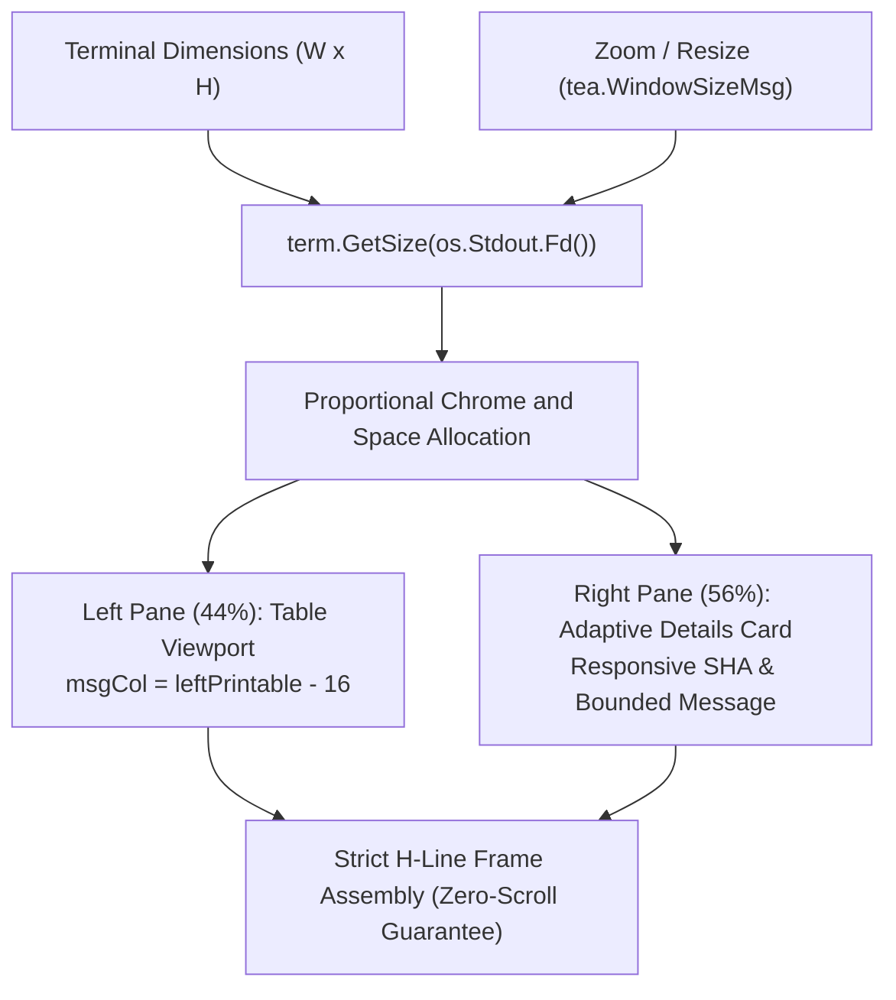
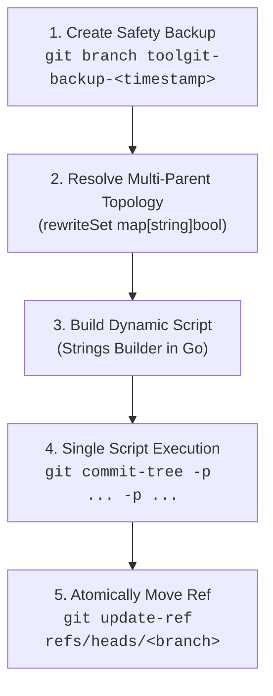

# Architecture and Internal Mechanics

This guide provides a comprehensive breakdown of `toolgit`'s internal architecture, mathematical distribution models, Git plumbing mechanics, and event loop lifecycle.

---

## Table of Contents

1. [Model-View-Update (MVU) Architecture](#1-model-view-update-mvu-architecture)
2. [Git Discovery and Delimited Stream Parsing](#2-git-discovery-and-delimited-stream-parsing)
3. [Organic Time Jitter and Active Days Engine](#3-organic-time-jitter-and-active-days-engine)
4. [Responsive Layout and Zero-Scroll Engine](#4-responsive-layout-and-zero-scroll-engine)
5. [Non-Destructive Git Plumbing Engine](#5-non-destructive-git-plumbing-engine)
6. [Interactive Modal System](#6-interactive-modal-system)
7. [Development Toolchain and PATH Registration](#7-development-toolchain-and-path-registration)

---

## 1. Model-View-Update (MVU) Architecture

`toolgit` is built on [Bubble Tea](https://github.com/charmbracelet/bubbletea), following the Elm-style Model-View-Update paradigm:



---

## 2. Git Discovery and Delimited Stream Parsing

When `toolgit` initializes, it inspects the working directory:



### Why ASCII Control Delimiters?
- **Unit Separator (`%x1f` / `0x1F`)**: Separates commit fields (Hash, Parent Hashes `%P`, Author, Email, ISO Timestamp, Raw Body `%B`).
- **Record Separator (`%x1e` / `0x1E`)**: Separates individual commits.
- **Benefit**: Eliminates parsing bugs caused by newlines, tabs, emojis, or multiline commit messages. `%P` enables multi-parent merge awareness without extra `rev-list` queries.

---

## 3. Organic Time Jitter and Active Days Engine

Naive distribution ($\Delta t = \frac{T_{\text{end}} - T_{\text{start}}}{N - 1}$) produces robotic `:00` seconds and slips into midnight sleep hours. `toolgit` replaces this with **Organic Developer Simulation**:

### A. Single-Day Ranges: Normalized Weight Jitter
For single-day intervals (e.g., `09:00 AM – 05:00 PM`):
1. **Weight Generation:** Generates $N-1$ random weights $w_i \in [0.5, 1.5]$.
2. **Normalized Duration:** 
   $$\Delta t_i = \frac{w_i}{\sum_{k=0}^{N-2} w_k} \cdot (T_{\text{end}} - T_{\text{start}})$$
3. **Micro-Seconds Jitter:** Adds $\pm 15$ seconds of random variance so timestamps land on natural seconds (e.g. `10:24:47`, `13:05:34`).
4. **Monotonicity Invariant:** Guarantees $t_i > t_{i-1} + 5\text{s}$ and clamps to $T_{\text{end}}$.

---

### B. Multi-Day Ranges: Active Days Partitioning
For multi-day intervals (e.g., April 2 to April 24):



1. **Target Day Count ($D$):** Defaults to $\min(\text{CalendarDays}, \lceil N / 2.5 \rceil)$ or user-specified value.
2. **Fisher-Yates Day Selection:** Pins Start Day (0) and End Day, randomly selecting $D-2$ distinct days across the calendar window.
3. **Commit Partitioning:** Assigns $\ge 1$ commit per active day, distributing remainder randomly to create natural burst days (2–4 commits) and rest days.
4. **Working Hours Clamping:** Commits on each day fall strictly within active daytime hours (`09:30 – 18:30`).

---

## 4. Responsive Layout and Zero-Scroll Engine

`toolgit` features an adaptive, mathematical split-pane layout engine designed to prevent terminal scrollback contamination, line wrapping, or visual distortion across any terminal dimensions or font zoom levels.



### A. Mathematical Dimension Invariants

To guarantee that the terminal emulator buffer never scrolls vertically (which causes flicker and cursor jitter):

| Component | Height Formula | Width Formula | Chrome Accounting |
|---|---|---|---|
| **Header Bar** | $1\text{ line}$ | $W\text{ cols}$ | Truncates subtitle on screens $< 70\text{ cols}$ |
| **Left Pane** | $H - 4\text{ lines (outer)}$<br>$H - 6\text{ lines (inner)}$ | $W_{\text{leftOuter}} = \lfloor W \cdot 0.44 \rfloor$<br>$W_{\text{leftInner}} = W_{\text{leftOuter}} - 2$ | $W_{\text{leftPrintable}} = W_{\text{leftOuter}} - 4$<br>(2 border chars + 2 padding chars) |
| **Right Pane** | $H - 4\text{ lines (outer)}$<br>$H - 6\text{ lines (inner)}$ | $W_{\text{rightOuter}} = W - W_{\text{leftOuter}}$<br>$W_{\text{rightInner}} = W_{\text{rightOuter}} - 2$ | $W_{\text{rightPrintable}} = W_{\text{rightOuter}} - 4$<br>(2 border chars + 2 padding chars) |
| **Footer Bar** | $3\text{ lines}$ (gap, status, help) | $W\text{ cols}$ | Responsive badges ($105+$, $75-104$, $<75$ cols) |
| **Total Frame** | **Exactly $H\text{ lines}$** | **Exactly $W\text{ cols}$** | **$1 + (H - 4) + 3 = H$ lines invariant** |

### B. Dynamic Table Resizing (`bubbles/table`)
Unlike static tables, `toolgit` dynamically resizes the table viewport and columns inside `resizeUI()`:
- **Status Column:** 4 chars (`✎M ✓`, `✎ M`, `  M ✓`, `✎   ✓`, `    ✓`). Shows `✎` (modified in memory), `M` (merge commit with 2+ parents), and `✓` (selected).
- **Hash Column:** 7 chars (`8fb0c5f`).
- **Message Column:** Dynamically scaled:
  $$W_{\text{msgCol}} = W_{\text{leftPrintable}} - 17$$
- **Header Separator Fit:** Table total width is strictly clamped to $W_{\text{leftPrintable}}$, preventing the table header separator line from wrapping onto a second row.

### C. Adaptive Right-Pane Cards
- **Dynamic SHA Length:** Displays full 40-char SHA on wide screens ($\ge 56\text{ cols}$ available); cleanly truncates to short SHA on narrow or zoomed-in displays.
- **Merge Badge and Parent Metadata:** If the active commit is a merge commit, the header renders a purple `⑂ MERGE` badge and lists all resolved parent short SHAs under a `Parents:` row.
- **Bounded Message View:** The commit message box has explicit `MaxWidth` and `MaxHeight` bounds derived from available pane lines, ensuring it never overflows the bottom pane border.

### D. Frame Padding & Zero-Scroll Invariant
At the end of `View()`, the screen lines are clamped and padded to **exactly $H$ lines**:
```go
lines := strings.Split(mainView, "\n")
if len(lines) > m.height {
    lines = lines[:m.height]
}
for len(lines) < m.height {
    lines = append(lines, "")
}
```
This invariant guarantees that navigation (<kbd>j</kbd>/<kbd>k</kbd>/<kbd>↑</kbd>/<kbd>↓</kbd>) and zooming (<kbd>Ctrl + +</kbd>/<kbd>Ctrl + -</kbd>) never push content into terminal scrollback.

---

## 5. Non-Destructive Git Plumbing Engine

`toolgit` executes metadata rewrites directly through Git's low-level object database, optimized into an **$O(1)$ Process Execution Pipeline**:



### Batch Execution Architecture & Topology Preservation
Instead of spawning **2 `git` processes per commit** via individual process calls (which introduces high process spawn overhead on Windows), `toolgit` dynamically builds a single script payload and executes it completely within a single process runspace.

- **Multi-Parent Topology Preservation:** Rather than a simple linear `$PARENT` accumulator, `toolgit` assigns each commit a unique variable `$NEW_<hash12>`. For each parent:
  - If the parent is within the current rewrite window, it resolves to `$NEW_<parent_hash12>`.
  - If the parent is outside the window (e.g., historical base commit), it resolves to the original parent SHA literal (`-p '<sha>'`).
  - Root commits omit `-p`; octopus merges include 3+ `-p` flags.
- **Multi-Line Messages:** Uses Here-Strings to accurately reconstruct commit bodies without variable escaping issues.
- **Immediate Failure Traps:** Checks exit codes natively to short-circuit upon any `commit-tree` errors.

> [!NOTE]
> **Zero Working Tree Risk:** `git commit-tree` creates new commit objects without performing a checkout. Uncommitted files or working tree changes on disk are never touched.

---

## 6. Interactive Modal System

Modals render as centered floating cards using `lipgloss.Place`:

1. **Author and Email Editor (<kbd>e</kbd>)**:
   - Live form navigation with <kbd>Tab</kbd> / <kbd>Shift+Tab</kbd>.
   - Supports single commit or batch updates across all selected commits.
2. **Time and Active Days Picker (<kbd>d</kbd>)**:
   - Interactive dropdown presets (Today Workday, Yesterday Workday, Past 3h, Past 8h, Custom Range).
   - Custom Range mode with Start Date, End Date, and Active Days fields.
   - Dynamic real-time preview of calendar days and active days distribution.
3. **Dry-Run Diff Review (<kbd>w</kbd>)**:
   - Side-by-side metadata diff table with modification flags.
   - Safety backup notice and confirmation guard.
   - Asynchronous background execution with live loading indicator.
4. **Safety Rollback (<kbd>r</kbd>)**:
   - Menu of timestamped automatic safety backup branches (`toolgit-backup-<timestamp>`).
   - Restores branch synchronously inside a background goroutine with visual loading feedback.
5. **Branch Switcher & Launch Selector (<kbd>b</kbd>)**:
   - **Pre-TUI Picker:** On launch, if multiple local branches exist, prompts user to select a branch (skippable via `--branch <name>` or `-b <name>`).
   - **In-TUI Modal:** Interactive branch switcher with real-time fuzzy filtering.
   - **Dirty-Edit Safeguard:** Detects unapplied in-memory edits before switching, presenting a confirmation dialog to prevent accidental data loss.

---

## 7. Development Toolchain and PATH Registration

| Script | Command | Purpose |
|---|---|---|
| **Fast Build and Update** | `.\scripts\build\update.ps1` | Runs test suite, compiles `toolgit.exe`, and updates global `go install` |
| **Skip-Tests Build** | `.\scripts\build\update.ps1 -SkipTests` | Rapid local compile and install |
| **File Watcher** | `.\scripts\dev\watch.ps1` | Auto-detects `.go` file saves and updates global CLI in real time |
| **Batch Helper** | `.\scripts\build\update.cmd` | Command Prompt wrapper for Windows CMD |

The global CLI executable is registered at `%GOPATH%\bin\toolgit.exe` and is accessible anywhere from your system terminal.

